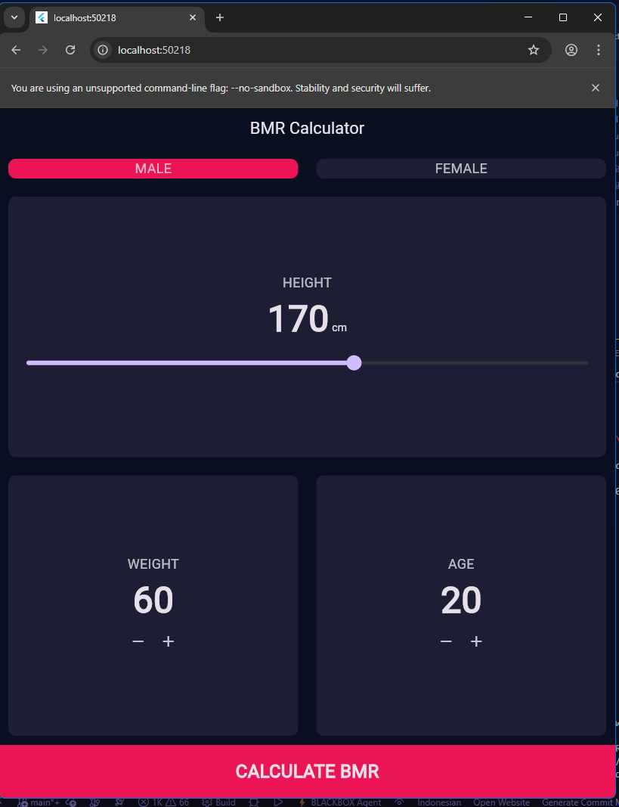
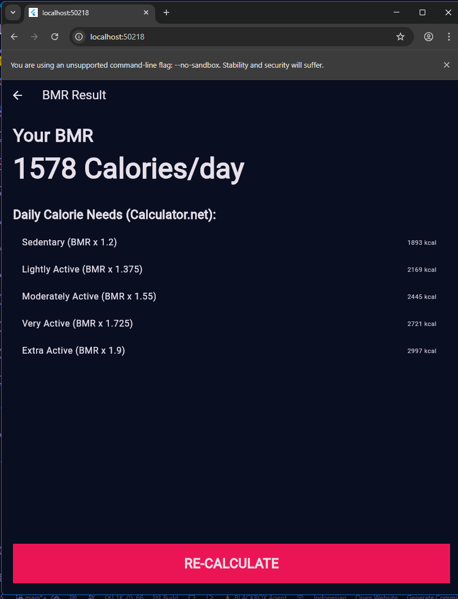

# BMR Calculator App

## Anggota Kelompok
1. K3523001 - 'Azzam Tsabitul Jamil
2. K3523051 - Muhammad Fahry Ali  
3. K3523069 - Rosyid Hanafi Utomo

## Deskripsi Aplikasi
Aplikasi BMR Calculator adalah aplikasi mobile yang dibangun menggunakan Flutter untuk menghitung Basal Metabolic Rate (BMR) dan kebutuhan kalori harian berdasarkan tingkat aktivitas pengguna.

### Fitur Utama
- Menghitung BMR berdasarkan jenis kelamin, tinggi badan, berat badan, dan usia
- Menampilkan kebutuhan kalori harian untuk berbagai tingkat aktivitas
- Antarmuka yang user-friendly dengan toggle jenis kelamin
- Input yang mudah dengan tombol increment/decrement

### Teknologi yang Digunakan
- Flutter SDK
- Dart Programming Language
- Material Design

## Screenshot Aplikasi

### Tampilan Kalkulator BMR

### Tampilan Hasil BMR

## Cara Menjalankan
1. Pastikan Flutter SDK terinstall
2. Clone repository ini
3. Jalankan `flutter pub get`
4. Jalankan `flutter run`

## Rumus BMR yang Digunakan
- **Pria**: BMR = 88.362 + (13.397 × berat dalam kg) + (4.799 × tinggi dalam cm) - (5.677 × usia dalam tahun)
- **Wanita**: BMR = 447.593 + (9.247 × berat dalam kg) + (3.098 × tinggi dalam cm) - (4.330 × usia dalam tahun)
